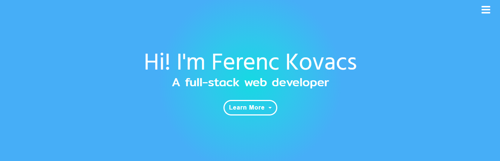

# Ferenc Kovacs Resume

This project is to showcase my skills and expertise as a full stack web developer for prospective employers. This project was built using only three major elements HTML5, CSS3 and Bootstrap.

There are various pages that allow a prospective employer to better understand my background.

##### About Me 
> Provides a brief page of information about me and my highlights from each for the below pages.

##### Portfolio 
> Showcases my work as a developer (all visible in GitHub).

##### Skills 
> Provides information on my coding language skills including courses that have helped me achieve these skills.

##### Experience 
> Provides information on my workplace experience throughout my career.

##### Contact 
> Provides the ability for the visitor to contact me through a web form.

## UX

### Function
This project is for prospective employers, recruiters, clients and Code Institute markers. These 4 user types will want to achieve 2 major goals. Firstly, the prospective employers, recruiters and clients will want to identify if I have the capabilities required for their needs. Code Institute markers will want to identify if I have the build the website according to their project specifications. This project will satisfy both as the content and pages of the project clearly showcase my capabilities as a developer and the way the project was built will show Code Institute markers the project was built according to specification.

### Styling

This website was built with speed and simplicity in mind. Hence background radial gradients were selected for the header and footer for a clean a cool colouring using the colour blue (rather than background-images). The background gradient was generated using [WebGradients](https://webgradients.com/) and the colour palette was generated using [ColorSpace](https://mycolor.space/) to find complementary colours for the website.

The fonts used are Hind Vadodara and Mitr using [Google Fonts](https://fonts.google.com/) and imported to the style.css file.

### User Stories
- As a recruiter, I want to determine the prospects capabilities, so that I can place successful candidates.
- As an employer, I want to determine the prospects capabilities, so that I can hire a valuable resource.
- As a client, I want to determine the prospective suppliers' capabilities, so that I can utilise a valuable supplier.
- As a Code Institute marker, I want to determine the student has achieved the learning outcomes so that I can score the level of achievement (out of 5).

### Page Sections

##### Header
> This section consists of 2 header elements centred and 2 navigation options. A standard burger menu and a drop-down menu.
##### Footer
> The footer has 3 elements, a left aligned text, centre aligned drop-down navigation menu and right aligned social media buttons.
##### Main
- About Me
    > Has 2 major sections, one showing the highlights of the resume and the other with a short blurb.
- Experience
    > Is a vertical timeline displaying work experience from earliest to latest which is left and right aligned consecutively.
- Skills
    > Is a vertical timeline displaying development language skills from the earliest learnt to the latest which is left and right aligned consecutively.
- Portfolio
    > Displays in a grid, rows of 3 cards with each displaying the title, languages used, blurb and clicks to the project.
- Contact
    > Displays a contact form with 5 input fields for users to contact me.

### Mockups
The project mockups are available in the mockups directory in both mobile and desktop views.

## Features
 
### Existing Features
- Responsiveness - allows the website to render in a user-friendly display on any device
- Tooltips - on the skills page each course pill will display a tooltip when clicked
- Timeline - displays the natural progression over time in a more user-friendly display
- Resume download - allows the user to download my resume which is available in all navigation elements
- Contact form - allows the user to contact the author through the web form

## Technologies Used

### Languages
-	HTML / HTML5
>	To display content on each HTML page and enable the use of more semantic elements used in HTML5
-	CSS / CSS3
>	To style content in each HTML page and enable additional styling features by using CSS3
-	JavaScript
>	To make HTML content more dynamic and to enable features that are supported by Bootstrap

### Libraries
-	Bootstrap
>	To speed up the building of the project using the front end framework that has been tied and tested
-	Font Awesome
>   To make the project more visually appealing to users through the use of icons
-	W3Schools
>	The timeline used in the skills and experience pages are based on a timeline obtained from W3Schools
-	Google Fonts
>	To make enable custom fonts to be used in the project. Hind Vadodara and Mitr were selected
-	jQuery
>	To simplify Dom manipulation and to enable Bootstrap features

## Testing

This project was tested using the Google Chrome Inspect tool. Using the aforementioned tool the website was tested using multiple screen sizes. These screen sizes include various mobile, tablet, and desktop sizes using both portrait and landscape views.

The following checks were done to ensure the website is working as intended:
- All links working and directed correctly
- All styles applied and display correctly
- All icons displayed with the intended styling
- All navigation elements are working as intended
- All tooltips are operating as intended
- Resume download links operate as intended
- Timelines stack on mobile devices
- Contact form fields are all required with a submit button

## Deployment

This project has been deployed on GitHub Pages using the following method:
- When in the overview page select the repository you would like to publish
- When in the appropriate repository, using the repository navigation bar select the settings option
- When in the settings screen scroll down to GitHub Pages heading and below the source, sub-heading select the branch you would like to deploy (in this case the master branch was used)
- Enter the name for your project and publish it (Ferenc Kovacs Resume was used)
- Wait for the website deployment to be finalised by GitHub

> The deployed version is the latest version of the website

In addition, to run this code locally you need to open the HTML files in your browser. To display the local CSS and js files you will need to update the HTML file links to local paths on your computer.

## Credits

### Content
- The icons used in this project are from [FontAwesome](https://fontawesome.com/)
- The timeline used is from [W3Schools](https://www.w3schools.com/howto/howto_css_timeline.asp)
- Most elements of this website use [Bootstrap](https://getbootstrap.com/) elements
- The gradient backgrounds are from [WebGradients](https://webgradients.com/)
- The colour palette was chosen using [ColorSpace](https://mycolor.space/)
- The fonts were selected from [Google Fonts](https://fonts.google.com/)

### Acknowledgements
- I received inspiration for this project from [Pinterest](https://za.pinterest.com/)
- [Rock Band](https://karolsliwka.github.io/Rock-Band/)
- [Rosie Odenkirk](https://traveltimn.github.io/ucd-resume/)
- And [Haley Schafer](https://code-institute-solutions.github.io/StudentExampleProjectGradeFive/)
